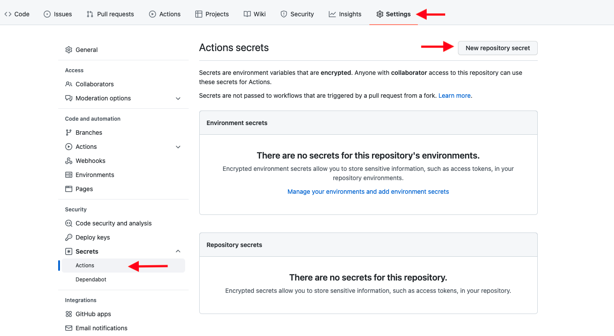

# NAPPTIVE Github Actions

Helping developers to focus on creating awesome applications facilitating the implementation of their wokflows.

Napptive's github actions allows you to define workflows in a very simple way.

You will be able to quickly prepare a test environment by deploying the catalog applications you need, upload your code to the catalog to always have the latest version of your application available, update a deployed application, etc.

All these tasks and many more will be very easy with the napptive github actions.

## Prerequisites

### Napptive Account

- You will need a Napptive Account. [Try for free!!](https://playground.napptive.dev).

### Playground client

- Install the playground cli. Follow the instructions in the [documentation](https://docs.napptive.com/playground/Installation.html) to know how to install.

### Personal Access Token

- Once you have an account, you will need to create a [PAT](https://docs.napptive.com/guides/Using_personal_access_tokens.html). The actions will need this PAT  to login to the plaform.

```bash
$ playground login
Logged into account [account] - environment [environment]
```

create a PAT:

```bash
playground user pat create github-actions
Current environment: account/environment
NAME              TOKEN
github-actions    <PAT>

Please store this value safely as it cannot be retrieved once generated. To login with this value,...
```

and create a new Github Secret with the PAT.
_Settings -> Secret -> Actions -> New Repository secret_


